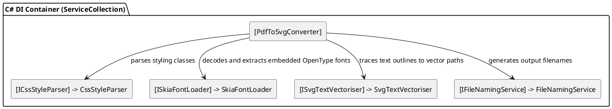

# PDF2SVG Console - Pure Backend C# PDF to Vector SVG Outline Converter

A high-performance C# .NET 8 console application that converts PDF pages to SVG files with **all fonts fully vectorized into path outlines** (`<path d="..." />`). 

This approach completely eliminates browser/headless-Chrome dependencies, rendering PDFs into beautiful vector graphics with perfect multilingual and CJK (Chinese, Japanese, Korean) support. The output SVGs are fully compatible with vector design tools like Figma, Sketch, or Adobe Illustrator with zero font dependencies.

---

## ⚡ Why This Pure Backend Approach?

1. **Lightweight & Dependency-Free**: No Puppeteer, Chromium, or headless Chrome is required. Everything runs natively in C# and SkiaSharp.
2. **Exceptional Speed**: Page rendering and font vectorization complete in under 2 seconds (up to **100x faster** than browser-based Puppeteer automation).
3. **Perfect Figma & Vector Graphics Compatibility**: Since all fonts are converted directly to vector path curves, the output SVG renders identically on all systems, even if they don't have the original PDF fonts installed.
4. **Dynamic Word Spacing**: The converter parses horizontal coordinate arrays (`x` and `y` lists) inside PDF text attributes to retain accurate glyph layouts and spacing.
5. **Clean Architecture**: Built with modern C# SOLID design principles, dependency injection, and decoupled interfaces for parsing, style processing, font loading, naming, and vectorization.

---

## 🛠️ Prerequisites

- **.NET 8.0 SDK** or later
- Works out-of-the-box on macOS, Linux, and Windows

---

## 🚀 Building & Running

Restore dependencies and build the application:
```bash
dotnet restore
dotnet build
```

### 1. Interactive Prompt Flow
If you run the application with no arguments, a clean interactive CLI prompt will guide you through the conversion:
```bash
dotnet run
```

#### Step 1: Input Path
The console will prompt you to enter the path to the source PDF file:
```text
Enter the path to your PDF file: /Users/name/Documents/presentation.pdf
```
*(If the file path is left blank or does not exist, a red error message is shown and the application exits gracefully.)*

#### Step 2: Output Selection
Once a valid input file path is loaded, you will see a cyan selection menu for specifying where to save the generated SVGs:
```text
Select output directory option:
  [1] Next to the PDF (default)
  [2] Current running folder
  [3] Custom folder path
Enter choice (1, 2, or 3, default is 1): 
```
* **Choice 1 (Next to the PDF)**: Automatically generates and saves SVGs in the same directory as the source PDF.
* **Choice 2 (Current running folder)**: Saves SVGs to the directory where the terminal command was executed.
* **Choice 3 (Custom folder path)**: Prompts you to enter a custom path (e.g. `/Users/name/Documents/OutputSVGs/`).

---

### 2. Command Line Arguments Mode
For headless environments, CI/CD pipelines, or power users, you can bypass the interactive prompts by passing CLI arguments:

```bash
dotnet run -- <path_to_pdf> [<output_directory>]
```

| Argument | Description |
|---|---|
| `<path_to_pdf>` | Path to the input PDF file (required in CLI mode). |
| `[output_directory]` | Optional directory to save output SVGs. Defaults to the same directory as the input PDF file. |

#### Examples:

* **Basic Conversion** (saves output SVGs next to the source PDF):
  ```bash
  dotnet run -- /Users/name/Documents/presentation.pdf
  ```

* **Custom Output Folder**:
  ```bash
  dotnet run -- /Users/name/Documents/presentation.pdf /Users/name/Documents/OutputSVGs/
  ```

---

## ✨ Features

- **Vector Outlined Typography**: Replaces all `<text>` and `<tspan>` nodes with high-fidelity `<path>` outlines, stripping large font binary blobs to minimize SVG sizes.
- **Multilingual CJK Support**: Converts Traditional/Simplified Chinese, Japanese, and Korean glyphs seamlessly.
- **Multi-page Extraction**: Saves each page as a separate vector SVG, automatically naming them according to the page count (e.g., `filename_page_1.svg`, `filename_page_2.svg`).
- **Original Layout Fidelity**: Preserves curves, shapes, paths, lines, colors, and precise character spacing.

---

## 🏗️ Technical Architecture & Dependency Injection

The console application is built using a clean, modular architecture. Everything is registered in the dependency injection container inside `Program.cs` and coordinated by `PdfToSvgConverter`:



### Components Responsibility

1. **`ICssStyleParser` (CssStyleParser)**:
   Extracts style rules and classes within `<style>` blocks in the parsed SVG. This is crucial for matching text elements with their resolved font-families and sizing rules.
   
2. **`ISkiaFontLoader` (SkiaFontLoader)**:
   Extracts and parses base64-encoded binary font streams directly from `<defs>` elements into native SkiaSharp `SKTypeface` objects. It also handles clean-up, removing heavy font binary assets from the final SVG once vectorization is complete.

3. **`ISvgTextVectoriser` (SvgTextVectoriser)**:
   Coordinates character layout tracking, horizontal coordinate list mappings (`x="..."`), and maps characters to glyph bezier vectors, tracing precise vector outlines (`<path d="..." />`) to replace live `<text>` elements.

4. **`IFileNamingService` (FileNamingService)**:
   Computes standard naming schemas for converted pages, ensuring consistent outputs such as `document_page_1.svg` or `document.svg` for single-page files.

5. **`PdfToSvgConverter`**:
   The top-level coordinator. It opens the PDF document using `PdfToSvg.NET`, iterates through each page, triggers standard rendering, executes the post-processing pipeline (styling extraction, font loading, text vectorization), and writes clean SVG files.
