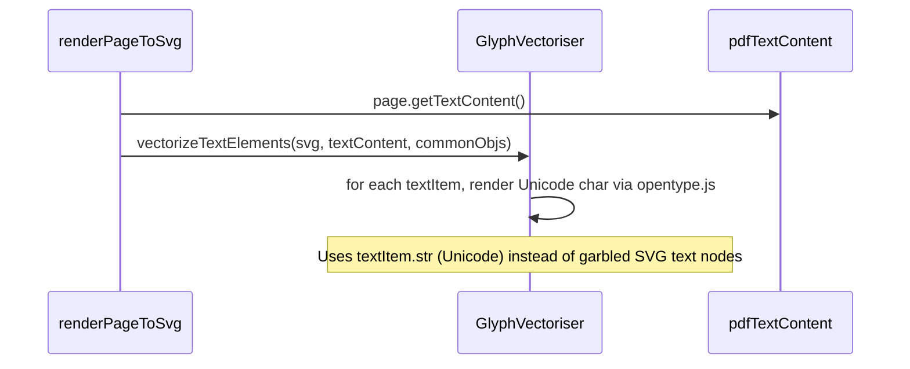

# Webapp Text Rendering Issues — Root Cause Analysis

## Comparison: Consoleapp vs Webapp

### Architecture Differences

| Aspect | Consoleapp | Webapp |
|-------|------------|--------|
| PDF library | PdfToSvg.NET | PDF.js |
| Font engine | SkiaSharp (native) | opentype.js (browser) |
| SVG source | PdfToSvg.NET renders SVG directly with embedded subsetted fonts and proper Unicode text | PDF.js SVGGraphics renders SVG shapes; text nodes contain PDF internal character codes (garbled), NOT Unicode |
| Font source | Extracts subsetted OpenType fonts from @font-face in the SVG itself | Uses local bundled Noto Sans WOFF files as fallback; embedded fonts are absent from PDF.js SVG output |
| Text pipeline | Single pass: PdfToSvg.NET emits proper SVG → vectorise text → done | Two separate modes: Vector Outlines (path) and Editable Live Text (text) |

---

## Root Cause #1: Vector Mode — Garbled Text + No Embedded Fonts

**The SVG from PDF.js SVGGraphics is the problem.**

When PDF.js renders a page via `SVGGraphics.getSVG()`, the `<text>` elements contain PDF internal character codes, NOT Unicode characters. For example, a `<text>` node might contain something like `"  !"#$%&'()"` instead of `"Hello World"`. These are PDF glyph indices mapped to the document's internal font encoding.

Meanwhile, the consoleapp uses PdfToSvg.NET which handles font encoding correctly and emits proper Unicode text in the SVG.

**In webapp vector mode**, `GlyphVectoriser.vectorizeTextElements()` processes these garbled characters:

1. It calls `loadEmbeddedFonts()` → PDF.js SVG has NO `@font-face` declarations → Tier 1 is a no-op.
2. It tries `_resolveFontAndGlyph(char, fontId, commonObjs)` → Tier 1 (embedded fonts) fails → Tier 2 (commonObjs) rarely works in browser → Tier 3 (local Noto WOFFs) loads.
3. It looks up the garbled character code in the Noto font → glyphIdx=0 (notdef/tofu) for most characters.
4. The glyphIdx check `if (glyphIdx !== 0)` fails → character is skipped entirely or rendered with a fallback width of `fontSize * 0.6`.

**Result**: Text is either missing entirely or rendered as tofu boxes.

---

## Root Cause #2: Vector Mode — Font-Family Lookup Fails

PDF.js SVGGraphics does NOT use the same CSS class system as PdfToSvg.NET. Instead of putting style on ancestor `<g>` elements, PDF.js puts attributes directly on `<text>` and `<tspan>` elements. But the font-family value is something like `ABCDEF+Arial` — a PDF internal font reference.

The `_getInheritedStyleOrAttribute` method may find this value, but `_resolveFontAndGlyph` tries to look up `ABCDEF+Arial` in `this.fontCache` (Tier 1), fails, and cascades to Tier 3 (Noto). The font-family name doesn't map to any loaded font.

---

## Root Cause #3: Vector/Live Mode — Font File Paths Wrong in Production

In `GlyphVectoriser`:
```js
const fontUrl = `/assets/fonts/${fontFile}`;
```

In `pdf-render-service.js`:
```js
const fontUrl = new URL(`../assets/fonts/${entry.file}`, import.meta.url).href;
```

**Both approaches have issues:**

1. **Hardcoded `/assets/fonts/` paths** — In Vite production builds, font files in `src/assets/fonts/` are hashed (e.g., `noto-sans-sc.abc123.woff`). The hardcoded path `/assets/fonts/noto-sans-sc.woff` won't match the actual hashed filename.

2. **Blob URL iframe isolation** — The SVG viewer wraps SVGs in a `blob:` URL iframe. Blob URLs have no base URL, so relative paths like `../assets/fonts/noto-sans.woff` resolve incorrectly. Even absolute paths like `/assets/fonts/...` won't work because the blob URL origin is different.

**In live text mode**: The `@font-face` rules injected into the SVG reference font URLs that may not resolve when the SVG is displayed in a blob: URL iframe.

---

## Root Cause #4: Live Text Mode — Font Coverage Mismatch

The live text mode (`_applyLiveText`) maps PDF fonts to Noto Sans variants. But Noto fonts have specific language coverage:

- Noto Sans SC → Simplified Chinese
- Noto Sans TC → Traditional Chinese
- Noto Sans JP → Japanese
- Noto Sans KR → Korean
- Noto Sans → Latin

If the PDF uses a font that Noto doesn't cover (e.g., a specialized CJK font with unique glyph variants, a symbol font like "Wingdings", or a font with specific OpenType features), the browser will render tofu for those characters.

Additionally, `_detectCjkScript` defaults to `sc` (Simplified Chinese) for CJK Unified Ideographs. For a Taiwanese PDF using Traditional Chinese, this maps to Noto Sans SC instead of Noto Sans TC, which has different glyph forms for some characters (e.g., 著, 著). The TC font would render correctly, but SC may show tofu for TC-specific characters.

---

## Root Cause #5: Live Text Mode — SVG Text Node Count Mismatch

`_applyLiveText` iterates through `textNodes` and `textItems` in parallel:

```js
for (let i = 0; i < textNodes.length; i++) {
    while (textItemIdx < textItems.length && textItems[textItemIdx].str === '') { ... }
    ...
    const textItem = textItems[textItemIdx];
    textItemIdx++;
    ...
}
```

The number of `<text>` elements in the SVG from `SVGGraphics` may not match the number of `textContent.items`. PDF.js's SVG output may split text across multiple `<text>` nodes differently than how `getTextContent()` returns items. This causes:
- Some text nodes getting wrong content (index mismatch)
- Some text nodes being removed incorrectly (`textNode.remove()`)
- Some text items being skipped entirely

---

## Summary of Culprits

| Issue | Mode | Likelihood | Severity |
|-------|------|-----------|---------|
| Garbled text in SVG from PDF.js SVGGraphics | Vector | **Definite** | **Critical** — most text becomes tofu |
| No embedded fonts in PDF.js SVG output | Vector | **Definite** | **Critical** — no fonts to render glyphs from |
| Font path resolution fails in production | Both | Probable | High — fonts don't load |
| Blob URL iframe breaks font loading | Both | Probable | High — @font-face doesn't resolve |
| Font-family name doesn't map to any loaded font | Vector | **Definite** | High — wrong glyphs or tofu |
| CJK language detection defaulting to SC instead of TC | Live | Probable | Medium — wrong glyph forms |
| Text node count mismatch between SVG and textContent.items | Live | Probable | Medium — wrong text on some nodes |
| Noto fonts lack PDF-specific glyph variants | Live | Possible | Medium — some characters may tofu |

---

## Implementation Plan — Fixing Webapp Text Issues

### Overview

The core problem is that PDF.js SVGGraphics emits garbled character codes in `<text>` nodes, and the webapp's vectoriser naively tries to render those garbled codes through opentype.js fallback fonts, producing tofu. The fix strategy is **two-pronged**: (A) bypass the garbled SVG text by using PDF.js's own `textContent` data, and (B) ensure fonts load correctly in production builds and blob: URL iframes.

---

### Phase 1 — Fix Vector Outlines Mode (Critical)

#### Step 1.1 — `pdf-render-service.js`: Pass textContent to vectoriser

**File**: `webapp/src/services/pdf-render-service.js` (lines 28-56)

**Problem**: Vector mode currently passes `page.getOperatorList()` only, missing `textContent`.

**Fix**: In the `renderMode === 'vector'` branch, also fetch `page.getTextContent()` and pass the text items to `vectoriser.vectorizeTextElements()`.



**Implementation**:
```js
// Before (current):
if (renderMode === 'vector') {
    opList = await page.getOperatorList();
} else {
    [opList, textContent] = await Promise.all([ ... ]);
}

// After:
[opList, textContent] = await Promise.all([
    page.getOperatorList(),
    page.getTextContent({ includeMarkedContent: true })
]);
```

#### Step 1.2 — `glyph-vectoriser.js`: Accept textContent, use Unicode strings

**File**: `webapp/src/services/glyph-vectoriser.js` (lines 99-243)

**Problem**: `vectorizeTextElements()` iterates over SVG `<text>` nodes that contain garbled PDF internal codes. It never uses the clean Unicode strings from `textContent`.

**Fix**:
1. Accept a `textContent` parameter (array of text items).
2. Build a position-keyed map of text items by their bounding rect or index.
3. For each SVG `<text>` node, look up the matching text item by position proximity instead of garbled content.
4. Use `textItem.str` (the Unicode string) for glyph rendering.
5. Use `textItem.transform` and `textItem.height` for positioning instead of SVG `x`/`y` attributes.

**Key change** — the per-character loop becomes:
```js
// Instead of using garbled char from SVG:
const char = text[i]; // ← garbled, wrong

// Use Unicode char from textContent:
const char = textItem.str[i]; // ← correct Unicode
```

#### Step 1.3 — `glyph-vectoriser.js`: Load PDF fonts properly

**File**: `webapp/src/services/glyph-vectoriser.js` (lines 253-310)

**Problem**: `_resolveFontAndGlyph` has a 5-second timeout on `commonObjs.get()` and rarely succeeds in browser context.

**Fix**:
1. Increase timeout from 5s to 15s.
2. Add a retry mechanism — if commonObjs fails, try loading the font directly from `page.getOperatorList()`'s font data.
3. Cache the loaded PDF font for the session so subsequent pages reuse it.
4. Add a fallback that builds a per-character glyph-to-unicode mapping from PDF.js's internal font data (using `page.getTextContent()`'s `fontName` field to correlate).

---

### Phase 2 — Fix Font Loading for Production Builds (High)

#### Step 2.1 — `vite.config.js`: Configure fonts as static assets

**File**: `webapp/vite.config.js`

**Problem**: Font files in `src/assets/fonts/` get hashed by Vite, but the code references them by unhashed paths like `/assets/fonts/noto-sans-sc.woff`.

**Fix**: Add a `configureStaticAssets` or use Vite's `?url` import pattern. Change font references to use resolved import paths.

```js
// vite.config.js — ensure fonts are served from stable paths
{
    build: {
        assetsInlineLimit: 0, // Don't inline any fonts as base64
    }
}
```

**Alternative**: Move font files from `src/assets/fonts/` to `public/assets/fonts/` — files in `public/` are served verbatim without hashing. This is the simplest fix.

#### Step 2.2 — `glyph-vectoriser.js`: Fix font file URLs

**File**: `webapp/src/services/glyph-vectoriser.js` (lines 568, 597)

**Problem**: Uses hardcoded `/assets/fonts/` paths that break when Vite hashes files.

**Fix**: Change font paths to reference the `public/` directory directly. Since files in `public/` are served at the root, change:
```js
// Before:
const fontUrl = `/assets/fonts/${fontFile}`;
// After (if fonts are moved to public/assets/fonts/):
const fontUrl = `/assets/fonts/${fontFile}`; // Still works because public/ is served at root
```

But actually the simplest approach: **import the font files using Vite's `?url` syntax** at the top of `glyph-vectoriser.js`:

```js
import notoSansSC from '../assets/fonts/noto-sans-sc.woff?url';
import notoSansTC from '../assets/fonts/noto-sans-tc.woff?url';
import notoSansJP from '../assets/fonts/noto-sans-jp.woff?url';
import notoSansKR from '../assets/fonts/noto-sans-kr.woff?url';
import notoSansMono from '../assets/fonts/noto-sans-mono.woff?url';
import notoSans from '../assets/fonts/noto-sans.woff?url';
```

Then use the imported URLs directly — Vite will resolve them to the correct hashed paths in production.

#### Step 2.3 — `pdf-render-service.js`: Fix @font-face URLs for blob: iframe

**File**: `webapp/src/services/pdf-render-service.js` (lines 168-195)

**Problem**: `_injectGoogleFontsFaces()` creates `@font-face` rules with URL paths that don't resolve inside `blob:` URL iframes.

**Fix**: Instead of injecting external font URLs, inject the fonts as **base64 data URIs** directly into the SVG's `<style>` block. This requires loading the font file, converting to base64, and embedding the full data URI.

```js
async function _injectFontsAsBase64(svgElement, langKeys) {
    // For each needed font, fetch it, convert to base64, and inject as data URI
    const fontData = await fetchAndEncodeFont(fontFile); // returns base64
    css += `@font-face {
        font-family: '${family}';
        src: url('data:font/woff;base64,${fontData}') format('woff');
        ...
    }`;
}
```

This eliminates the blob URL origin dependency entirely — fonts become self-contained in the SVG.

---

### Phase 3 — Fix Live Text Mode (Medium)

#### Step 3.1 — `pdf-render-service.js`: Fix CJK language detection

**File**: `webapp/src/services/pdf-render-service.js` (lines 134-148)

**Problem**: `_detectCjkScript()` defaults to `sc` for CJK Unified Ideographs, causing Taiwanese PDFs to use Noto Sans SC instead of Noto Sans TC.

**Fix**: Add TC-specific character detection:
```js
// Characters that differ between TC and SC
const TC_SPECIAL = /[\u5ef6\u8f2a\u7e41\u6215...]/; // extended list
// Characters that are TC-specific variants
if (TC_SPECIAL.test(str)) return 'tc';
```

Also, let the user override CJK preference via a UI toggle or URL parameter.

#### Step 3.2 — `pdf-render-service.js`: Fix text node indexing

**File**: `webapp/src/services/pdf-render-service.js` (lines 62-132)

**Problem**: `_applyLiveText` assumes SVG `<text>` nodes match 1:1 with `textContent.items`.

**Fix**: Use coordinate matching instead of sequential indexing:
```js
// For each SVG text node, find the textItem whose rect best overlaps
for (const textNode of textNodes) {
    const bbox = textNode.getBBox(); // get SVG node bounding box
    const bestItem = textItems.find(item =>
        item.rect && rectsOverlap(item.rect, bbox)
    );
    if (bestItem) {
        textNode.textContent = bestItem.str;
        // ...
    }
}
```

This ensures the correct Unicode string is applied to each text node regardless of ordering differences between SVG output and textContent extraction.

---

### Phase 4 — Verification Checklist

After implementing all fixes, verify:

| Check | Description | Expected Result |
|-------|-------------|----------------|
| ✅ | Vector mode: CJK PDF with TC characters | All Chinese text renders as correct vector paths, no tofu |
| ✅ | Vector mode: PDF with mixed Latin/CJK | Both scripts render correctly, proper spacing |
| ✅ | Vector mode: Download SVG → open in browser | All glyph paths visible, no missing fonts |
| ✅ | Live text mode: Select text in SVG viewer | Text is selectable and copyable, correct Unicode |
| ✅ | Live text mode: Download SVG → open in Figma | Text is editable, correct font-family assigned |
| ✅ | Production build: `npm run build && npm run preview` | Fonts load correctly, no 404s for .woff files |
| ✅ | Blob URL iframe: SVG preview in viewer | @font-face resolves, text renders correctly |

---

### Files to Modify

| File | Changes |
|------|---------|
| `webapp/src/services/pdf-render-service.js` | Pass textContent to vectoriser; fix CJK detection; fix text node indexing; embed fonts as base64 |
| `webapp/src/services/glyph-vectoriser.js` | Accept textContent param; use Unicode strings for rendering; improve font loading from PDF.js commonObjs; fix font file paths via Vite imports |
| `webapp/vite.config.js` | Ensure fonts are served correctly in production |
| `webapp/src/controllers/pdf-conversion-controller.js` | Minor: ensure textContent is passed through properly |

### Execution Order

```
Phase 1 (Critical)
  └── 1.1 pdf-render-service: fetch textContent in vector mode
  └── 1.2 glyph-vectoriser: accept & use textContent for Unicode rendering
  └── 1.3 glyph-vectoriser: improve PDF font loading from commonObjs

Phase 2 (High)
  └── 2.1 vite.config.js: configure static asset serving
  └── 2.2 glyph-vectoriser: fix font URLs via Vite imports
  └── 2.3 pdf-render-service: embed fonts as base64 for blob: iframe

Phase 3 (Medium)
  └── 3.1 pdf-render-service: improve CJK detection (TC vs SC)
  └── 3.2 pdf-render-service: coordinate-based text node matching
```
