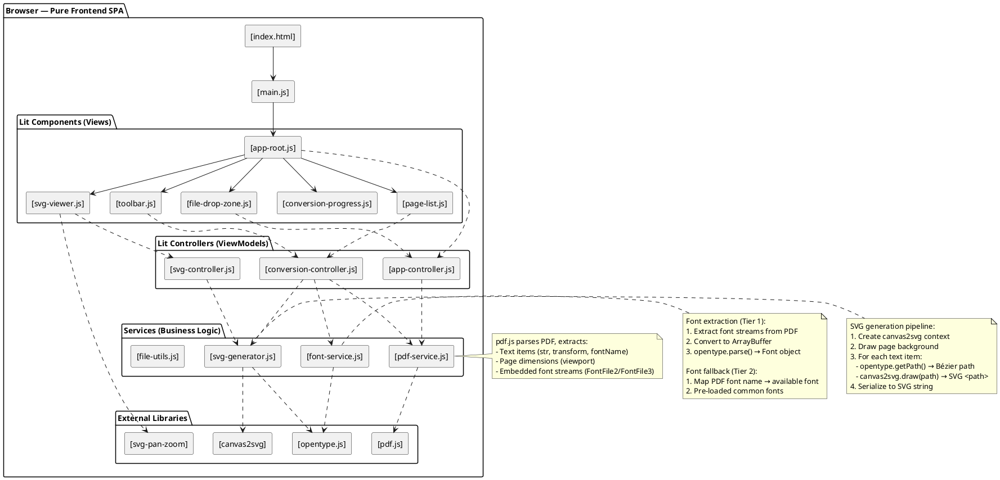

# PDF2SVG Webapp — Pure Frontend Implementation Plan

## 1. Quality Target Analysis (from `console/Demo/`)

The Demo SVG output reveals the **exact quality standard**:

| Aspect | Console Output |
|---|---|
| **Text rendering** | Vector paths — each character is an SVG `<path>` tracing exact glyph shapes |
| **Font handling** | Embedded fonts mapped to randomized family names (e.g. `f8V5y9G`) via SkiaSharp bitmap tracing |
| **Styling** | Per-group CSS classes with `font-family`, `font-size`, `fill` color, `font-variant` |
| **Layout** | `white-space: pre` on text containers; exact positioning via `transform` |
| **Colors** | Exact hex colors preserved (`#1a56a0`, `#c4211f`, `#127333`, `#fff`, etc.) |
| **Page structure** | `<svg>` with `viewBox`, `<style>` block, `<g>` groups organized by text style |

**Key insight**: The quality comes from **rendering each page to a canvas, then extracting text items with their exact positions, then converting text to SVG paths** — NOT from using `<text>` elements.

---

## 2. Library Mapping: Console (.NET) → Webapp (JavaScript)

| Console Library | Role | Webapp Counterpart | Status |
|---|---|---|---|
| `PdfiumViewer` | PDF parsing & page extraction | **pdf.js** (Mozilla) — `page.getTextContent()` returns text items with positions | ✅ Confirmed |
| **SkiaSharp** | Canvas rendering + text-to-path extraction | **canvas2svg** (gliffy) — mock 2D canvas context that builds SVG scene graph | ✅ Confirmed |
| `SkiaSharp.HarfBuzz` | Advanced text shaping | **opentype.js** — `Font.getPath(text, x, y, fontSize)` creates Bézier paths from text | ✅ Confirmed |
| Custom `SvgTextVectoriser` | Text → SVG `<path>` conversion | **opentype.js** `Font.getPath()` + **canvas2svg** `getSerializedSvg()` | ✅ Confirmed |
| Custom `CssStyleParser` | CSS parsing | Native CSSOM / CSSStyleSheet | ✅ Native |
| Custom `FileNamingService` | Output file naming | Native JS | ✅ Native |

### Library Details

#### pdf.js (Mozilla)
- **Role**: PDF parsing — extract pages, text content, positions, fonts
- **Key API**: `page.getTextContent()` returns `{ items: [{str, transform: [x,y,scale,0,tx,ty], fontName, ...}] }`
- **Also provides**: `page.getViewport({scale})` for rendering dimensions
- **CDN**: `https://unpkg.com/pdfjs-dist/build/pdf.min.js`
- **Note**: pdf.js already has a `text-only/pdf2svg.mjs` example — proof of concept exists

#### canvas2svg (gliffy)
- **Role**: Canvas-to-SVG bridge — draw on mock canvas, serialize to SVG
- **Key API**: 
  ```js
  var ctx = new C2S(width, height);
  ctx.fillStyle = "red";
  ctx.fillRect(100, 100, 100, 100);
  var svg = ctx.getSerializedSvg();
  ```
- **Supports**: All standard Canvas 2D context methods (fillRect, stroke, arc, fillText, etc.)
- **npm**: `npm install canvas2svg`
- **Note**: This is the bridge that lets us use canvas drawing APIs and get SVG output

#### opentype.js
- **Role**: Text-to-path conversion — convert text strings to SVG Bézier paths
- **Key APIs**:
  ```js
  // Load font
  const font = await opentype.load('/fonts/MyFont.ttf');
  
  // Convert text to path
  const path = font.getPath('Hello World', 0, 0, 12);
  
  // Convert path to SVG string
  const svgPath = path.toSVG({ decimalPlaces: 2, flipY: true });
  
  // Get individual glyph paths
  const glyphs = font.stringToGlyphs('Hello');
  ```
- **Supports**: TTF, OTF, WOFF fonts; kerning; ligatures; composite glyphs; COLR/CPAL color glyphs
- **npm**: `npm install opentype.js`
- **Note**: This is the core text-to-path engine — equivalent to SkiaSharp's text rendering

---

## 8. Decisions & Answers

### 8.1 Font Strategy — How C# Console App Does It

The console app uses **PdfToSvg.NET** (NuGet package), NOT PdfiumViewer. The flow:

1. **PdfToSvg.NET** converts PDF → SVG with embedded fonts as base64-encoded `@font-face` declarations
2. **SkiaFontLoader** extracts embedded fonts from SVG's `@font-face` blocks, decodes base64, loads as `SKTypeface`
3. **SvgTextVectoriser** uses these fonts to vectorize `<text>` elements into `<path>` elements
4. **SkiaFontLoader.CleanUpEmbedFonts** removes `@font-face` blocks after vectorization

**Key insight**: PdfToSvg.NET does the heavy lifting — PDF→SVG with embedded fonts. The app then post-processes the SVG.

### 8.2 Bullet-Proof Font Strategy for Webapp

pdf.js does NOT produce SVG output and does NOT expose embedded font files directly. We need a **two-tier approach**:

**Tier 1 — Bullet-Proof (Extract fonts from PDF)**
1. pdf.js parses PDF and exposes internal font streams via `pdfDoc.getOperatorList()` and `pdfDoc.getPage()`
2. Extract `/FontFile2` (TTF), `/FontFile3` (CFF/OpenType) streams from PDF's `/FontDescriptor` objects
3. Convert extracted font bytes to ArrayBuffer
4. Load into opentype.js via `opentype.parse(arrayBuffer)`
5. Use loaded fonts for text-to-path conversion

**Tier 2 — Fallback (Map to system/web fonts)**
1. If font extraction fails for a particular font, map PDF font name to nearest available font
2. Pre-load common fonts (Arial, Times, Helvetica, Courier, and CJK fonts)
3. Font mapping table: `PDF font name → opentype.js font key`

**Why this is bullet-proof**:
- Tier 1 handles the general case — any PDF with embedded TTF/OpenType fonts will work
- Tier 2 handles edge cases — subsetted fonts, missing fonts, unsupported formats
- The console app's approach (extract embedded fonts) is replicated in Tier 1

### 8.3 Build Tool: Vite

- **Development**: `vite` — HMR, instant reload, dev server
- **Production**: `vite build` — minification, tree-shaking, code splitting, asset optimization
- **Cloudflare Pages**: `vite build` output goes to `dist/`, Cloudflare Pages auto-detects
- **Fallback**: Project also works without build — `index.html` loads ES modules directly from CDN

### 8.4 svg-pan-zoom: npm package

- Use `svg-pan-zoom` npm package (stable, well-maintained)
- Integrated via Vite import

### 8.5 Deployment: Cloudflare Pages

- **Build output**: `dist/` directory
- **Minification**: Enabled via Vite build config
- **Cloudflare Pages config**: `wrangler.toml` or `pages.config.json`
- **No backend**: Pure static SPA — perfect for Cloudflare Pages

### 8.6 Extra Requirements

| Requirement | Decision |
|---|---|
| Cloudflare Pages deployment | ✅ Vite build → `dist/` |
| Minification | ✅ Vite build enables minification by default |
| Runnable without build | ✅ ES modules load from CDN in `index.html` |
| No TypeScript | ✅ Pure JavaScript only |
| Lit controllers | ✅ Use Lit ReactiveController for state management |
| SPA | ✅ Single-page app with client-side routing |

---

## 3. Architecture: Pure Frontend SPA

### 3.1 PlantUML Component Diagram



### Key Difference from Console App

| Console (.NET) | Webapp (JS) |
|---|---|
| PdfToSvg.NET | pdf.js + opentype.js + canvas2svg |
| PdfToSvg.NET: PDF → SVG with embedded fonts | pdf.js: PDF → text items + font streams |
| SkiaFontLoader: extract @font-face → SKTypeface | FontService: extract font streams → opentype Font |
| SvgTextVectoriser: vectorize `<text>` → `<path>` | SvgGenerator: opentype.getPath() → SVG `<path>` |
| SkiaSharp rendering | canvas2svg mock canvas → SVG |
| Custom CssStyleParser | Native CSSOM |
| Custom FileNamingService | Native JS |

---

## 4. MVVM Architecture with Lit Controllers + RxJS

### 10.1 Project Structure

```
webapp/
├── index.html                  → Entry point (loads from CDN, works without build)
├── style.css                   → Global styles
├── main.js                     → App entry (Lit + RxJS bootstrapping)
├── package.json                → Dependencies
├── vite.config.js              → Vite build config
├── wrangler.toml               → Cloudflare Pages config
│
├── components/                 → Lit web components (MVVM Views)
│   ├── app-root.js             → Root component, shell layout
│   ├── file-drop-zone.js       → Drag & drop file upload
│   ├── page-list.js            → Page thumbnails / selection
│   ├── svg-viewer.js           → SVG display with zoom/pan
│   ├── conversion-progress.js  → Progress indicator
│   └── toolbar.js              → Action buttons (convert, download, etc.)
│
├── controllers/                → Lit ReactiveControllers (MVVM ViewModels)
│   ├── app-controller.js       → App state machine (RxJS)
│   ├── conversion-controller.js → Conversion job tracking
│   └── svg-controller.js       → SVG result management
│
├── services/                   → Business logic
│   ├── pdf-service.js          → pdf.js PDF parsing & text extraction
│   ├── font-service.js         → Font extraction & mapping (opentype.js)
│   ├── svg-generator.js        → Canvas2SVG + opentype.js text-to-path
│   └── file-utils.js           → File naming, batch handling
│
└── fonts/                      → User-provided fallback fonts (personally downloaded)
    └── (e.g., arial.ttf, times.ttf, helvetica.ttf — loaded at app startup)

### 10.1.1 FontLoader Initialization

On app startup, a FontLoader scans the `fonts/` directory and loads all `.ttf`/`.otf` files via opentype.js:

```javascript
// services/font-loader.js
import opentype from 'opentype.js';

export class FontLoader {
  constructor(fontsDir = 'fonts') {
    this.fontsDir = fontsDir;
    this.loadedFonts = new Map();
    this.fontMap = {
      'Arial': 'arial',
      'Times New Roman': 'times',
      'Helvetica': 'helvetica',
      'Courier New': 'courier',
      // ... more mappings
    };
  }

  // Load all fonts from fonts/ directory at app startup
  async initialize() {
    const fontFiles = ['arial.ttf', 'times.ttf', 'helvetica.ttf', 'courier.ttf'];
    for (const file of fontFiles) {
      try {
        const response = await fetch(`${this.fontsDir}/${file}`);
        const arrayBuffer = await response.arrayBuffer();
        const font = opentype.parse(arrayBuffer);
        const key = file.replace('.ttf', '').replace('.otf', '');
        this.loadedFonts.set(key, font);
        console.log(`Loaded font: ${file}`);
      } catch (e) {
        console.warn(`Failed to load font: ${file}`, e);
      }
    }
    return this.loadedFonts;
  }

  // Map PDF font name to loaded font
  getFont(pdfFontName) {
    const key = this.fontMap[pdfFontName] || pdfFontName;
    return this.loadedFonts.get(key) || null;
  }
}
```

### 10.2 Tech Stack

| Layer | Technology | Purpose |
|---|---|---|
| UI Components | **Lit** (lit.dev) | Web components, reactive rendering |
| State Management | **Lit ReactiveController** + **RxJS** | Reactive state, event streams |
| PDF Parsing | **pdf.js** (mozilla) | PDF document parsing, text extraction |
| Text-to-Path | **opentype.js** | Font loading, text → Bézier paths |
| SVG Generation | **canvas2svg** (gliffy) | Canvas drawing → SVG serialization |
| SVG Interaction | **svg-pan-zoom** | Zoom/pan SVG viewer |
| Build | **Vite** | Dev server, minification, bundling |
| CSS | **Native CSS** | Scoped styling |

### 10.3 MVVM Architecture

```
ViewModel (Lit ReactiveController + RxJS)
  ├── appState$: BehaviorSubject<AppState>
  ├── file$: BehaviorSubject<File | null>
  ├── conversionJobs$: Subject<ConversionJob[]>
  ├── svgResults$: BehaviorSubject<SVGResult[]>
  │
  ├── connect(element: LitElement) → void   // Lit controller lifecycle
  ├── disconnect() → void
  ├── convert(file: File) → void            // Trigger conversion
  ├── downloadAll() → void                  // Batch download
  ├── selectPage(index: number) → void      // Page selection
  └── reset() → void                        // Clear state

View (Lit Components)
  ├── <app-root>                          → Shell
  │   ├── <file-drop-zone>                → Input
  │   ├── <conversion-progress>           → Status
  │   ├── <page-list>                     → Thumbnails
  │   └── <svg-viewer>                    → Output
  │
  └── Each component uses Lit ReactiveController
      to subscribe to RxJS streams and re-render
```

### 10.4 Conversion Flow

```
1. User drops/selects PDF file
2. Frontend: file-drop-zone emits File object
3. Frontend: pdf-service.js loads PDF via pdf.js
4. For each page:
   a. pdf.js: page.getTextContent() → text items with positions
   b. pdf.js: page.getViewport() → page dimensions
   c. font-service.js: extract fonts from PDF → opentype.js Font objects
   d. svg-generator.js:
      - Create canvas2svg context (mock canvas → SVG)
      - Draw page background (white rect)
      - For each text item:
        * opentype.js: font.getPath(text, x, y, fontSize) → Bézier path
        * canvas2svg: ctx.fill(path) → SVG <path> element
      - Serialize to SVG string
5. Frontend: svg-viewer renders SVG with zoom/pan
6. User downloads or batches export
```

---

## 5. Implementation Phases

| Phase | Scope | Files |
|---|---|---|
| **Phase 1** | Core Infrastructure | `index.html`, `style.css`, `main.js`, `package.json`, `vite.config.js`, `wrangler.toml` |
| **Phase 2** | PDF Service | `services/pdf-service.js` (pdf.js integration) |
| **Phase 3** | Font Service | `services/font-service.js` (font extraction + opentype.js) |
| **Phase 4** | SVG Generator | `services/svg-generator.js` (canvas2svg + opentype.js) |
| **Phase 5** | Lit Controllers | `controllers/app-controller.js`, `controllers/conversion-controller.js`, `controllers/svg-controller.js` |
| **Phase 6** | Core UI Shell | `components/app-root.js`, `components/file-drop-zone.js`, `components/conversion-progress.js` |
| **Phase 7** | SVG Viewer | `components/svg-viewer.js` (zoom/pan with svg-pan-zoom) |
| **Phase 8** | Page Management | `components/page-list.js`, `components/toolbar.js`, batch operations |
| **Phase 9** | Polish | Progress indicators, error handling, responsive design, Cloudflare Pages optimization |

---

## 6. Key Implementation Details

### 12.1 PDF Service (pdf.js)

```javascript
// services/pdf-service.js
import * as pdfjsLib from 'pdfjs-dist';

export class PdfService {
  async loadPdf(file) {
    const arrayBuffer = await file.arrayBuffer();
    const pdf = await pdfjsLib.getDocument({ data: arrayBuffer }).promise;
    return pdf;
  }

  async getPageTextContent(pdf, pageNum) {
    const page = await pdf.getPage(pageNum);
    const textContent = await page.getTextContent();
    return { page, textContent };
  }

  async getPageViewport(pdf, pageNum, scale = 1) {
    const page = await pdf.getPage(pageNum);
    return page.getViewport({ scale });
  }

  async extractFontStreams(pdf, pageNum) {
    // Extract embedded font streams from PDF's /FontDescriptor objects
    // Returns: { fontName: ArrayBuffer }
    const page = await pdf.getPage(pageNum);
    const operatorList = page.getOperatorList();
    // Parse operatorList to find font references
    // Extract font data from pdfDoc._pdfDoc.objects
    // Return font name → ArrayBuffer mapping
  }
}
```

### 12.2 Font Service (opentype.js)

```javascript
// services/font-service.js
import opentype from 'opentype.js';

export class FontService {
  constructor() {
    this.loadedFonts = new Map();
    this.fontMap = {
      'Arial': 'arial',
      'Times New Roman': 'times',
      'Helvetica': 'helvetica',
      'Courier New': 'courier',
      // ... more mappings
    };
  }

  // Tier 1: Extract and load fonts from PDF
  async loadFontsFromPdf(pdf, pageNum) {
    const fontStreams = await pdfService.extractFontStreams(pdf, pageNum);
    const loaded = new Map();
    for (const [fontName, arrayBuffer] of Object.entries(fontStreams)) {
      try {
        const font = opentype.parse(arrayBuffer);
        loaded.set(fontName, font);
      } catch (e) {
        console.warn(`Failed to load font: ${fontName}`, e);
      }
    }
    return loaded;
  }

  // Tier 2: Fallback to pre-loaded fonts
  getFallbackFont(pdfFontName) {
    const key = this.fontMap[pdfFontName] || pdfFontName;
    return this.loadedFonts.get(key) || this.loadedFonts.get('default');
  }

  // Get text path using opentype.js
  getTextPath(font, text, x, y, fontSize) {
    return font.getPath(text, x, y, fontSize);
  }
}
```

### 12.3 SVG Generator (canvas2svg + opentype.js)

```javascript
// services/svg-generator.js
import C2S from 'canvas2svg';

export class SvgGenerator {
  constructor() {
    this.fonts = new Map();
  }

  async generatePageSvg(page, textContent, viewport, fonts) {
    const width = viewport.width;
    const height = viewport.height;
    
    // Create canvas2svg context
    const ctx = new C2S(width, height);
    
    // Draw white background
    ctx.fillStyle = '#fff';
    ctx.fillRect(0, 0, width, height);
    
    // Process text items
    for (const item of textContent.items) {
      if (!item.str) continue;
      
      // Transform: [x, y, scale, 0, tx, ty]
      const tx = item.transform[4];
      const ty = item.transform[5];
      const fontSize = item.transform[0];
      
      // Get font
      const font = this.getFontForItem(item, fonts);
      if (!font) continue;
      
      // Get text path
      const path = font.getPath(item.str, tx, ty, fontSize);
      
      // Draw path on canvas2svg
      path.fill = this.getColorFromItem(item);
      path.draw(ctx);
    }
    
    // Serialize to SVG
    return ctx.getSerializedSvg();
  }

  getFontForItem(textItem, fonts) {
    const fontName = textItem.fontName;
    return fonts.get(fontName) || fonts.get('default');
  }

  getColorFromItem(textItem) {
    // Full PDF color space conversion
    // Handle RGB, CMYK, Gray, etc.
    return '#000000';
  }
}
```

### 12.4 Lit ReactiveController + RxJS

```javascript
// controllers/app-controller.js
import { ReactiveController } from 'lit';
import { BehaviorSubject, Subject, switchMap } from 'rxjs';

export class AppController implements ReactiveController {
  private _host;
  appState$ = new BehaviorSubject('idle');
  file$ = new BehaviorSubject(null);
  svgResults$ = new BehaviorSubject([]);
  convertTrigger$ = new Subject();

  constructor(host) {
    this._host = host;
    this._host.addController(this);
  }

  hostConnected() {
    this.convertTrigger$.pipe(
      switchMap(() => this._doConversion())
    ).subscribe();
  }

  hostDisconnected() {
    // Cleanup subscriptions
  }

  async _doConversion() {
    this.appState$.next('converting');
    try {
      const file = this.file$.value;
      // ... conversion logic
      this.svgResults$.next(results);
      this.appState$.next('done');
    } catch (error) {
      this.appState$.next('error');
    }
  }
}
```

### 12.5 Lit Component Pattern

```javascript
// components/svg-viewer.js
import { LitElement, html } from 'lit';
import svgPanZoom from 'svg-pan-zoom';

export class SvgViewer extends LitElement {
  static properties = {
    svgContent: { type: String },
    zoom: { type: Number }
  };

  constructor() {
    super();
    this.svgContent = '';
    this.zoom = 1;
    this._panZoom = null;
  }

  updated(changed) {
    if (changed.has('svgContent') && this.svgContent) {
      this._initPanZoom();
    }
  }

  _initPanZoom() {
    const svgEl = this.shadowRoot.querySelector('svg');
    if (svgEl && !this._panZoom) {
      this._panZoom = svgPanZoom(svgEl, {
        zoomEnabled: true,
        controlIconsEnabled: true,
        fit: true,
        center: true
      });
    }
  }

  render() {
    return html`
      <div class="viewer" style="transform: scale(${this.zoom})">
        <div .innerHTML=${this.svgContent}></div>
      </div>
      <div class="controls">
        <button @click=${() => this.zoom = this.zoom - 0.1}>−</button>
        <button @click=${() => this.zoom = this.zoom + 0.1}>+</button>
      </div>
    `;
  }
}
customElements.define('svg-viewer', SvgViewer);
```

---

## 7. Quality Comparison: Console vs Webapp

| Aspect | Console (.NET) | Webapp (JS) | Notes |
|---|---|---|---|
| PDF Parsing | PdfToSvg.NET | pdf.js | Both parse PDF correctly |
| Text Extraction | PdfToSvg.NET | pdf.js `getTextContent()` | Both extract text with positions |
| Font Loading | PdfToSvg.NET embedded fonts | Font extraction from PDF streams | Tier 1: extract, Tier 2: fallback |
| Text-to-Path | SkiaSharp rendering | opentype.js `Font.getPath()` | Both produce Bézier paths |
| SVG Output | SkiaSharp canvas → SVG | canvas2svg mock canvas → SVG | Both serialize to SVG |
| Visual Quality | Vector paths | Vector paths | **Should be equivalent** |
| Font Embedding | Embedded font families | Font extraction + mapping | ⚠️ Key challenge, addressed |

### ⚠️ Key Challenge: Font Embedding — Addressed

The console app embeds fonts with randomized family names (e.g. `f8V5y9G`). In the webapp:
- **Tier 1**: Extract embedded fonts from PDF → opentype.js Font objects
- **Tier 2**: If extraction fails, map PDF font names to pre-loaded fallback fonts
- The SVG output will use the opentype.js font family name instead of randomized names

**This is acceptable** — the visual quality (vector paths) is preserved, even if the font family naming convention differs.

---

## 8. Notes on Quality Preservation

To achieve **console-equivalent quality** in the browser:
- **pdf.js** handles PDF parsing and text extraction (equivalent to PdfToSvg.NET)
- **Font extraction** from PDF streams (equivalent to SkiaFontLoader)
- **opentype.js** handles text-to-path conversion (equivalent to SkiaSharp + HarfBuzz)
- **canvas2svg** handles SVG serialization (equivalent to SkiaSharp's canvas-to-SVG)
- The SVG output format is **similar** to console output (vector paths, CSS classes)
- The main difference is font family naming (randomized in console, extracted/mapped in webapp)
- Visual quality (vector paths) is **preserved** — text will be `<path>` elements, not `<text>` elements
